<details>
  <summary>Click to show images</summary>
  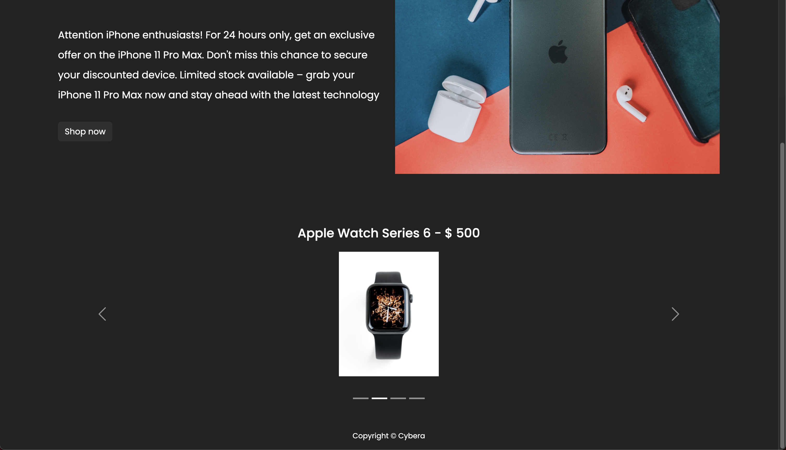
    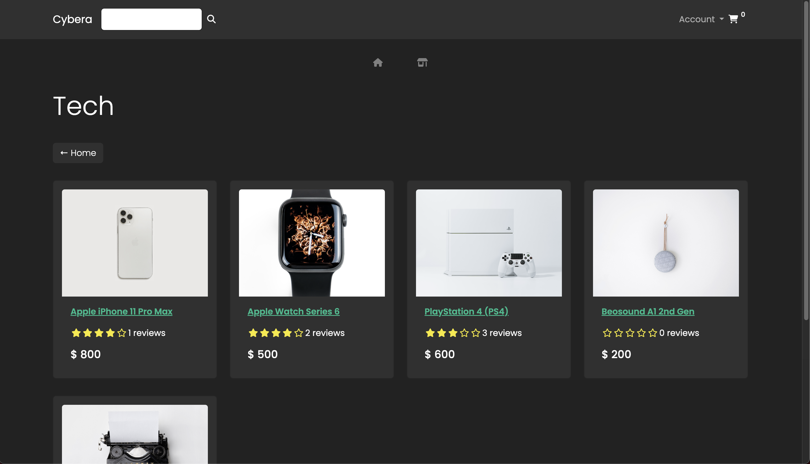
    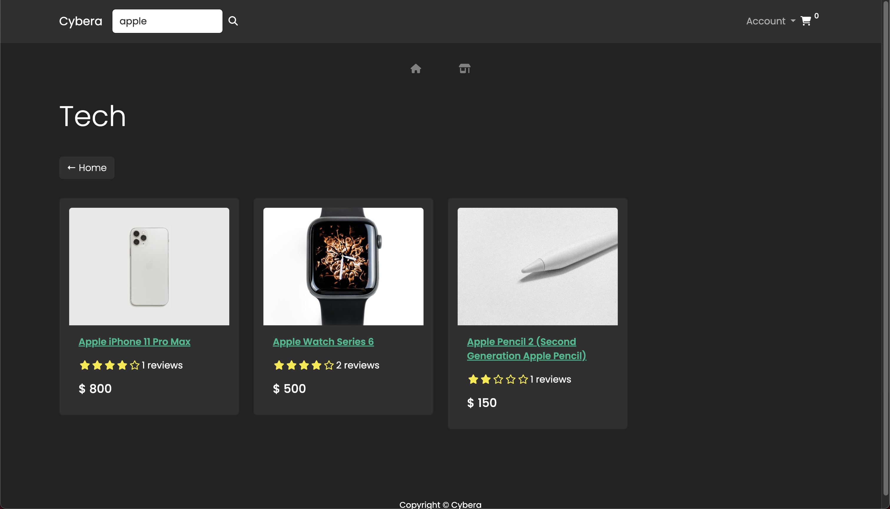
    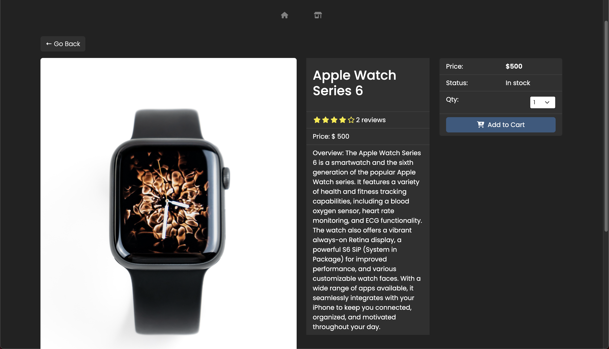
    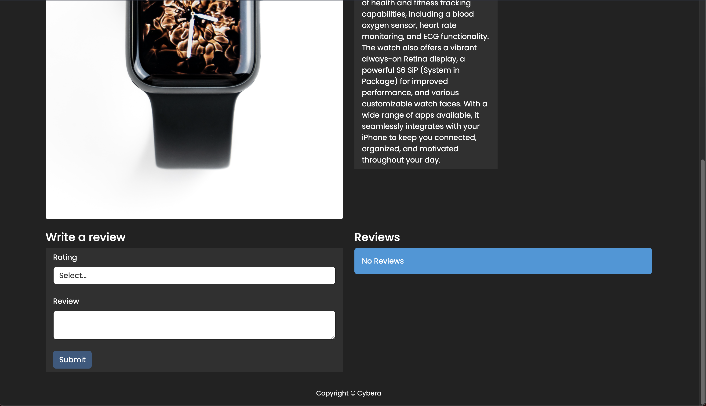
    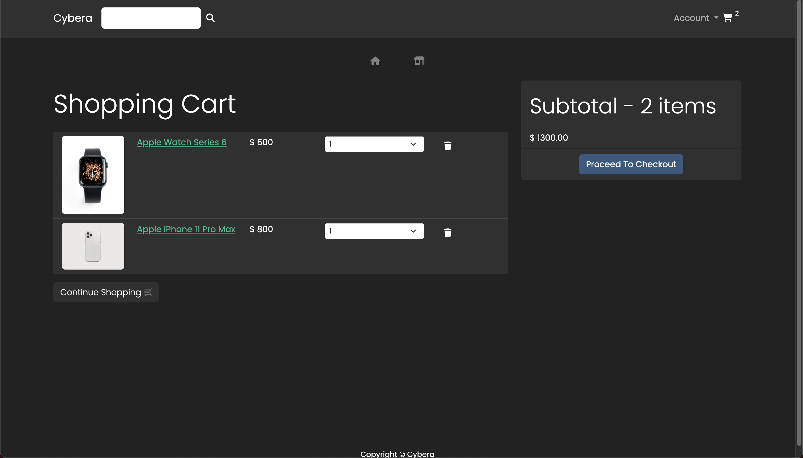
    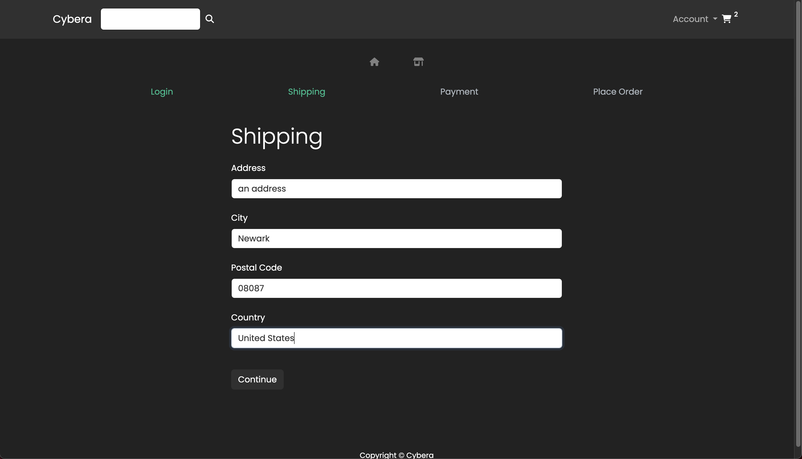
    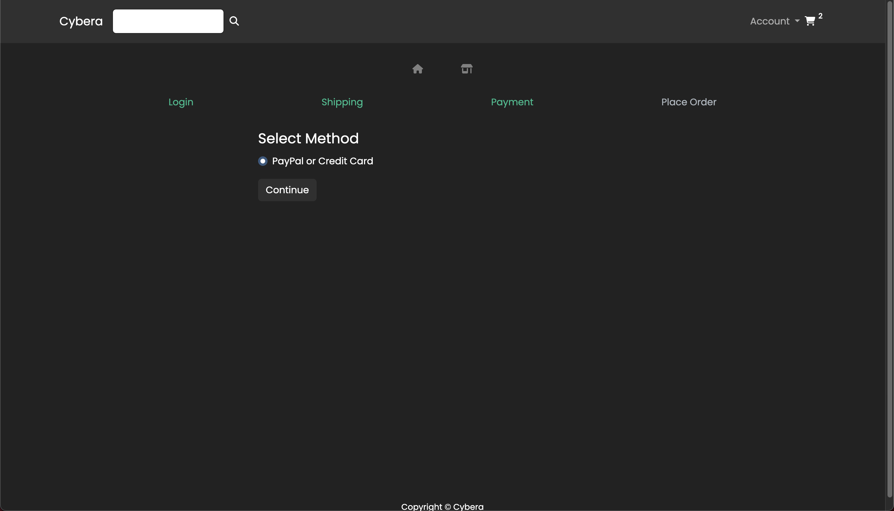
    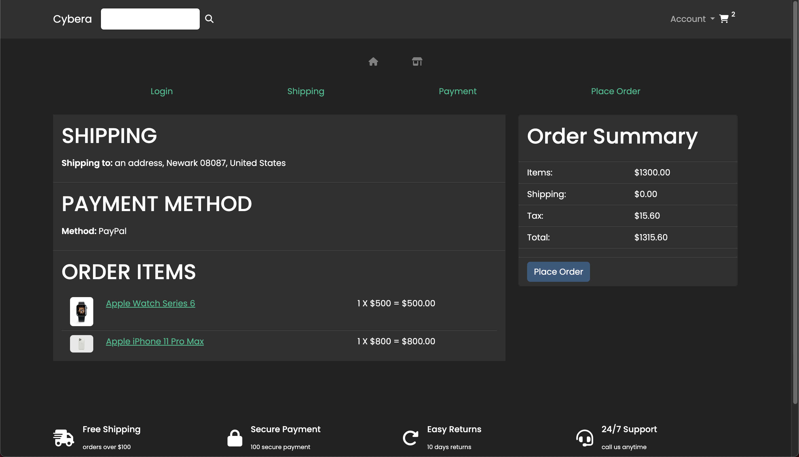
    
    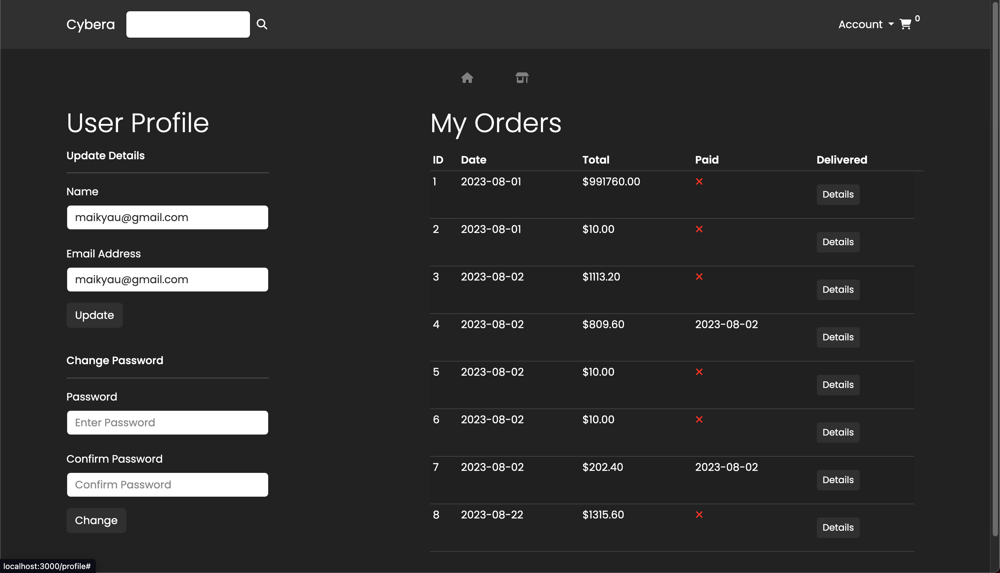
    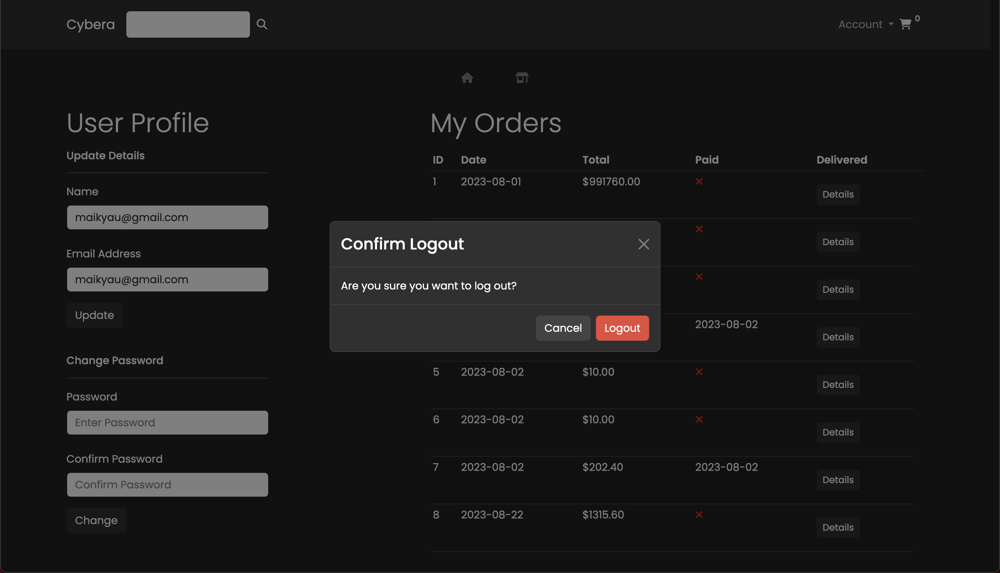
    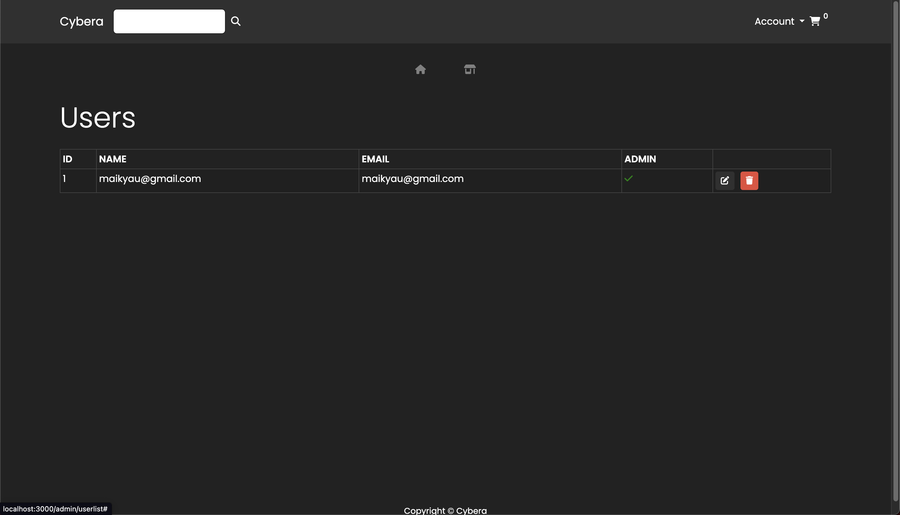
    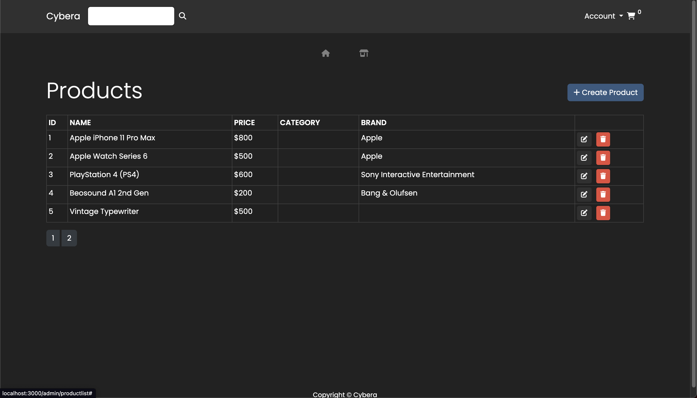
    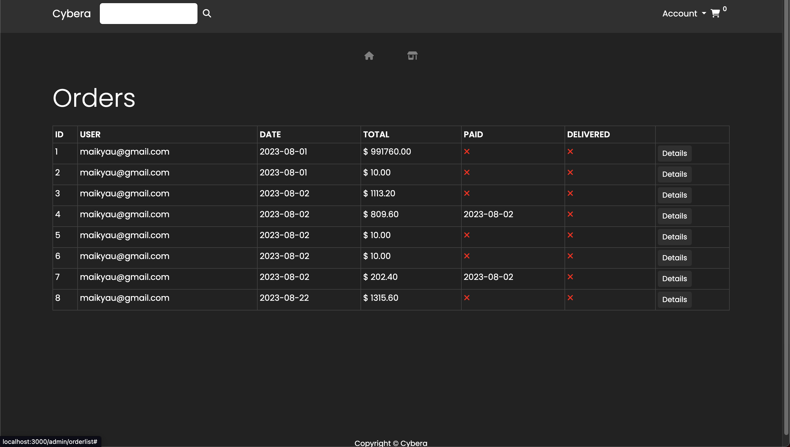
</details>

## 
# Techstore
This is a fully functional web app for tech products made using React(frontend) and Django(backend).


## Installation


### Prerequisites
- Python (3.x)
- Node.js

### Setting up the Environment

#### Windows
1. Clone the repository:
```shell
git clone https://github.com/thebugged/techstore.git
```

2. Create a virtual environment: 
```shell
python -m venv env
```

3. Activate the virtual environment:
```shell
env\Scripts\activate
```

4. Install the Python dependencies:
```shell
pip install -r requirements.txt
```

5. Install the Node.js dependencies:
```shell
cd frontend
npm install
```
or 
```shell
npm install --force
```


#### macOS/Linux
1. Clone the repository:
```shell
git clone https://github.com/thebugged/techstore.git
```

2. Create a virtual environment: 
```shell
python -m venv env
```

3. Activate the virtual environment:
```shell
source env/bin/activate
```

4. Install the Python dependencies:
```shell
pip install -r requirements.txt
```

5. Install the Node.js dependencies:
```shell
cd frontend
npm install
```
or 
```shell
npm install --force
```


## Running the App
The frontend and backend is not combined as usual, so you would need to run the sevrers seperately.

1. From the backend directory run the Django development server:
```shell
cd backend
python manage.py runserver
```

The app will be accessible at http://127.0.0.1:8000/.

2. From the frontend directory run the React development server:
```shell
cd frontend
npm start
```

The app will be accessible at http://localhost:3000/.
